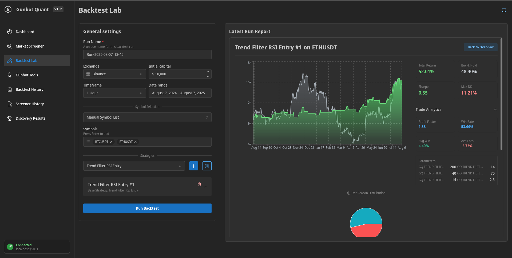

# Gunbot Quant (GQ)

[](https://opensource.org/licenses/MIT) [](https://www.python.org/) [](https://fastapi.tiangolo.com/)

Gunbot Quant is an open-source, self-hosted toolkit for quantitative trading analysis. It integrates an advanced market screener, a multi-strategy backtesting engine, and serves as optional companion app for the [Gunbot](https://www.gunbot.com/) trading bot.

The application is a self-contained Python package serving its own React-based frontend, intended for local use. **Gunbot is not required** to use the core screening and backtesting features.




## Capabilities

Gunbot Quant is designed to provide a systematic, data-driven workflow for traders.

#### 1. Screen Markets with Precision
Build data-driven watchlists by filtering assets across crypto and stock markets. The screener goes beyond simple indicator values by incorporating market character heuristics, allowing you to find assets that are suitable for specific *types* of strategies.

**Example Screener Setups:**
-   **Find Prime Mean-Reversion Candidates:**
    -   Filter for `avg_vol_30d_quote > 10,000,000` to ensure liquidity.
    -   Add conditions `rsi_14p < 35` and `stochrsi_k_14_3_3 < 20` to find oversold assets.
    -   Add `adx_14p < 25` to ensure the asset is in a non-trending, ranging state.
-   **Identify High-Quality Trending Assets:**
    -   Filter for `price_vs_sma200 > 5` (price is 5% above the 200 SMA) to confirm a strong uptrend.
    -   Add `volatility_consistency < 3.0` to filter out assets with erratic price behavior.
    -   Add `volume_concentration_pct < 40` to avoid assets susceptible to pump-and-dump schemes.

#### 2. Backtest Strategies at Scale
Validate your ideas by running strategies against historical data. The engine is built for portfolio-level analysis, not just single-symbol tests.

-   **Portfolio Simulation:** Run multiple strategies across your entire screened watchlist in a single batch.
-   **Aggregated Analytics:** View the combined equity curve and performance metrics for your entire simulated portfolio.
-   **Comprehensive Reports:** Analyze 15+ key metrics, including Sharpe/Sortino Ratios, Max Drawdown, Profit Factor, and a breakdown of trade exit reasons.
-   **Strategy Library:** A suite of pre-built, configurable strategies covering Mean Reversion, Trend Following, Breakouts, and more.

#### 3. Integrate with Gunbot (Optional)
For Gunbot users, GQ acts as a powerful analytical and operational dashboard.

-   **Analyze Live Performance:** Connect to a running Gunbot instance to visualize the real-world equity curve of your active trading pairs.
-   **Discover Better Pairs:** Run your live pair's strategy against a basket of quality-screened alternative symbols to find potentially more profitable markets.
-   **Benchmark Live Strategies:** Compare the historical performance of your active Gunbot setup against the entire GQ strategy library.
-   **1-Click Deployment:** Add any successfully backtested strategy to your Gunbot instance with the exact tested parameters.

## Installation & Usage

#### Prerequisites
-   **Python** (3.10+)
-   **Poetry** (Python dependency manager)
> If you don't have these, please follow the detailed **[First-Time Setup Guide](#appendix-first-time-setup)** at the bottom of this document. Node.js is **not** required for standard use.

#### Running the Application
1.  **Download the Project:**
    -   Click the green `<> Code` button on the GitHub repository page and select **Download ZIP**.
    -   Extract the ZIP file to a permanent location on your computer.

2.  **Open a Terminal/PowerShell** and navigate into the extracted project folder (e.g., `cd C:\Users\YourUser\Desktop\gunbot-quant-main`).

3.  **Install Dependencies:**
    ```bash
    poetry install --no-root
    ```

4.  **Start the Application:**
    ```bash
    poetry run start
    ```

After starting, open your web browser and navigate to **`http://localhost:8000`**.

---

## Command-Line Interface (CLI)

For automation and headless operation, you can use the built-in CLI.

**List all pre-defined scenarios:**
```bash
poetry run gunbot-quant list-scenarios
```

**Run a specific scenario:**
```bash
poetry run gunbot-quant run "Mean_Reversion_Screener_Last_6_Months"
```

## For Developers

If you intend to modify the application frontend code, you will need **Node.js v20+** installed.

1.  **Clone & Install:**
    ```bash
    git clone https://github.com/Gunbot/gunbot-quant.git
    cd gunbot-quant
    poetry install
    npm install --prefix gunbot_quant/frontend
    ```

2.  **Run Dev Servers:**
    This starts the FastAPI backend (with auto-reload) and the Vite frontend (with hot-reloading).
    ```bash
    npm run dev
    ```
    -   Backend API: `http://localhost:8000`
    -   Frontend Dev Server: `http://localhost:5173`

## Gunbot Integration

-   **Reference SDK Implementation:** The code in `gunbot_quant/gunbot_api` serves as a practical, real-world example of how to use the official [Gunbot Python SDK](https://pypi.org/project/gunbot-sdk-python/).
-   **Strategy Compatibility:** The included strategy `.js` files are compatible with any **Gunbot Defi license** or higher. They provide a robust suite of open-source strategies that can be directly deployed to your bot from the GQ interface.

## License

This project is licensed under the MIT License. See the `LICENSE` file for details.

---

## Appendix: First-Time Setup

<details>
<summary><b>Click here for detailed prerequisite installation steps (Windows & Mac/Linux)</b></summary>
<br/>

**Windows**
1.  **Install Python:**
    -   Go to the [official Python website's download page](https://www.python.org/downloads/windows/).
    -   Download the "Windows installer (64-bit)".
    -   Run the installer. **Important:** On the first screen of the installer, check the box that says **"Add Python to PATH"**.
    -   Click "Install Now" and complete the setup.
    -   Open a new Command Prompt or PowerShell and type `python --version` to verify it's installed.

2.  **Install Poetry:**
    -   Open a new PowerShell terminal (not Command Prompt).
    -   Run the following command to download and install Poetry:
        ```powershell
        (Invoke-WebRequest -Uri https://install.python-poetry.org -UseBasicParsing).Content | py -
        ```
    -   Close and reopen PowerShell, then type `poetry --version` to verify it's installed.

**macOS / Linux**
1.  **Install Python:**
    -   Python is usually pre-installed. Open your terminal and check with `python3 --version`.
    -   If it's not installed or you need a newer version, it's best to use your system's package manager (e.g., `sudo apt-get install python3.10` on Debian/Ubuntu, or [Homebrew](https://brew.sh/) on macOS: `brew install python`).

2.  **Install Poetry:**
    -   Open your terminal and run the official installation script:
        ```bash
        curl -sSL https://install.python-poetry.org | python3 -
        ```
    -   Follow the on-screen instructions to add Poetry to your shell's PATH.
    -   Close and reopen your terminal, then type `poetry --version` to verify it's installed.

</details>